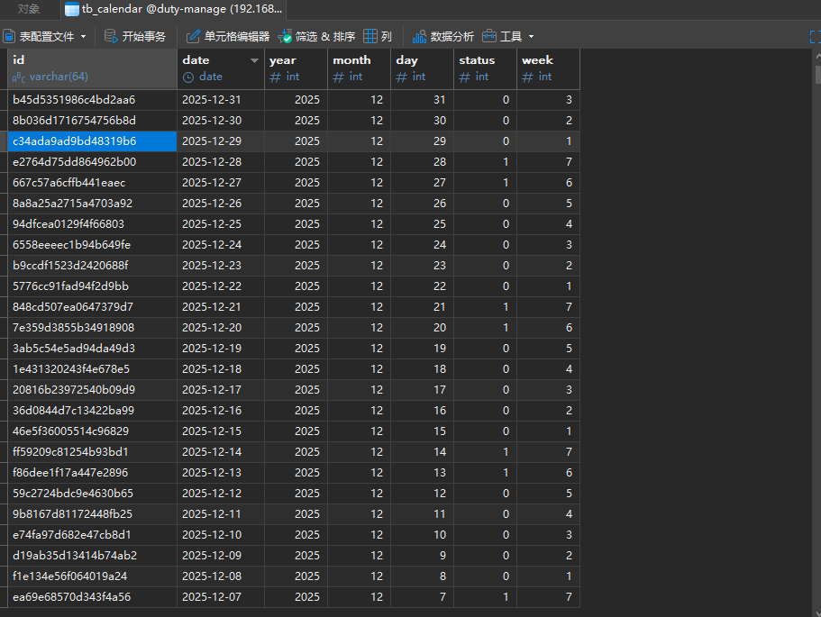
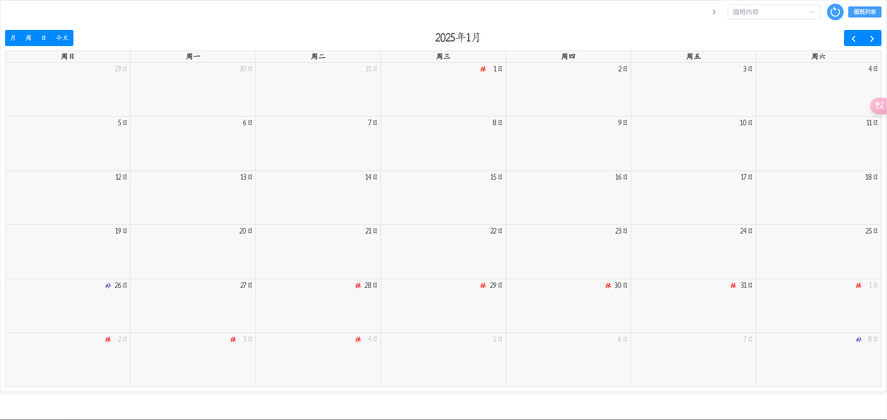

# 🗓️ Chinese Holiday Calendar Generator
基于Python的中国法定节假日数据生成SQL工具

## 🎯 项目介绍
本项目用于生成中国法定节假日数据，可直接生成SQL脚本导入数据库使用。主要用于企业排班、休假等系统的节假日依据。
## ✨ 功能特性
- 🔄 自动生成法定节假日数据 
- 📤 支持导出SQL脚本
- 📅 包含节假日、调休、周末等信息
- 🏢 适用于企业考勤、排班系统


## 🔧 环境要求
- 🐍 Python >= 3.x
- 💾 MySQL/MariaDB (用于导入生成的SQL脚本)

## 🚀 快速开始

### 1. 安装
```shell
git clone https://github.com/xiao-zaiyi/orc.git
cd chinese-holiday-generator
```

### 2. 初始化数据库
执行以下SQL脚本创建数据表:
```sql
CREATE TABLE `holiday_date` (
  `date` varchar(20) NOT NULL COMMENT '日期yyyy-MM-dd',
  `year` int(4) NOT NULL,
  `month` int(2) NOT NULL,
  `day` int(2) NOT NULL,
  `status` int(2) DEFAULT '0' COMMENT '状态码',
  PRIMARY KEY (`date`)
) ENGINE=InnoDB DEFAULT CHARSET=utf8 ROW_FORMAT=COMPACT;
```


### 3. 运行程序
```shell
python main.py
```

运行后会在当前目录生成 calendar_*.sql 文件，将该文件导入数据库即可使用。

## 📖 数据说明

### 状态码定义
| 状态码 | 含义 |
|--------|------|
| 0 | 👨‍💼 普通工作日 |
| 1 | 🏖️ 周末双休日 |
| 2 | 💪 需要补班的工作日 |
| 3 | 🎉 法定节假日 |


## 📝 项目背景
本项目是对 [holiday](https://github.com/Haoshenqi0123/holiday) 项目的改进。由于原项目更新较慢，且企业排班系统对节假日数据更新及时性要求较高，因此开发了本工具。

节假日数据来源 [holiday-cn](https://github.com/NateScarlet/holiday-cn/blob/master) 项目

## 🤝 贡献指南
欢迎提交 Issue 和 Pull Request，一起让这个工具变得更好！

## 📊 项目截图



## 🌟 特别感谢
感谢所有为这个项目做出贡献的开发者！
如对你有帮助麻烦动动小手手 star 🌟